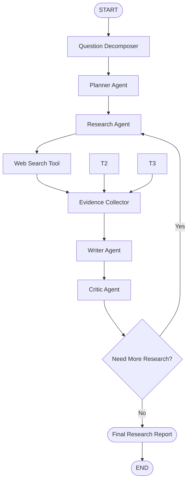

## Deep Research Agent Architecture

```mermaid
flowchart TD

    A([START]) --> B[Question Decomposer]
    B --> C[Planner Agent]
    C --> D[Research Agent]

    D --> T1[Web Search Tool]


    T1 --> E[Evidence Collector]
    T2 --> E
    T3 --> E

    E --> F[Writer Agent]
    F --> G[Critic Agent]

    G --> H{Need More Research?}

    H -->|Yes| D
    H -->|No| I([Final Research Report])

    I --> J([END])
```
