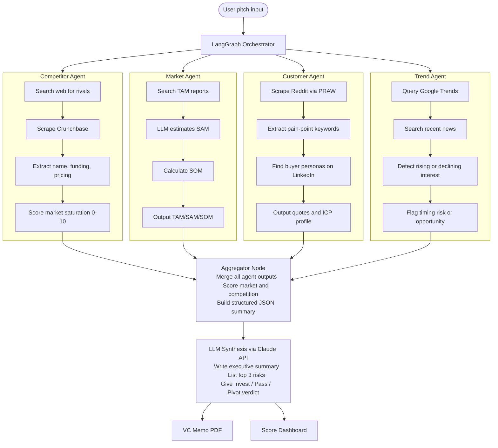

```mermaid
flowchart TD
    USER([User pitch input]) --> ORCH

    ORCH["LangGraph Orchestrator"]

    ORCH --> CA
    ORCH --> MA
    ORCH --> CUA
    ORCH --> TA

    subgraph CA["Competitor Agent"]
      CA1[Search web for rivals] --> CA2[Scrape Crunchbase]
      CA2 --> CA3[Extract name, funding, pricing]
      CA3 --> CA4[Score market saturation 0-10]
    end

    subgraph MA["Market Agent"]
      MA1[Search TAM reports] --> MA2[LLM estimates SAM]
      MA2 --> MA3[Calculate SOM] --> MA4[Output TAM/SAM/SOM]
    end

    subgraph CUA["Customer Agent"]
      CUA1[Scrape Reddit via PRAW] --> CUA2[Extract pain-point keywords]
      CUA2 --> CUA3[Find buyer personas on LinkedIn]
      CUA3 --> CUA4[Output quotes and ICP profile]
    end

    subgraph TA["Trend Agent"]
      TA1[Query Google Trends] --> TA2[Search recent news]
      TA2 --> TA3[Detect rising or declining interest]
      TA3 --> TA4[Flag timing risk or opportunity]
    end
    
    CA4 --> AGG
    MA4 --> AGG
    CUA4 --> AGG
    TA4 --> AGG

    AGG["Aggregator Node
    Merge all agent outputs
    Score market and competition
    Build structured JSON summary"]

    AGG --> SYN

    SYN["LLM Synthesis via Claude API
    Write executive summary
    List top 3 risks
    Give Invest / Pass / Pivot verdict"]

    SYN --> OUT1["VC Memo PDF"]
    SYN --> OUT3["Score Dashboard"]
```