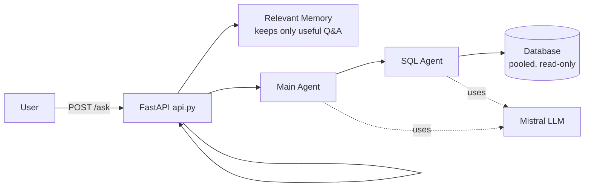
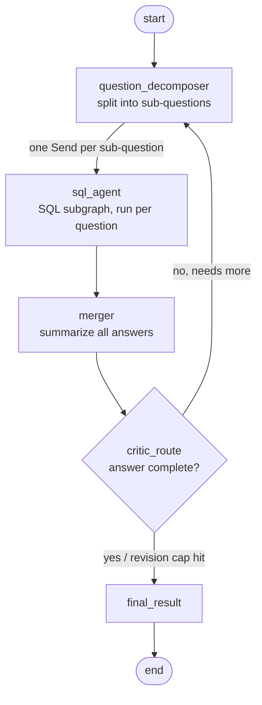
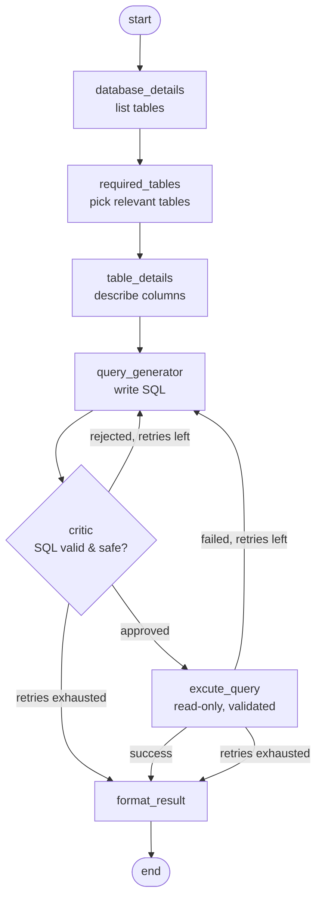

# Database Agent — Architecture

A simple view of how a question flows through the system.

## High level

## Main agent (orchestrator)

## SQL agent (subgraph, runs for each sub-question)

## Key guarantees

- **Read-only:** every query is validated before it runs; the DB session is read-only and never committed.
- **Bounded:** SQL retries capped by `SQL_MAX_RETRIES`; the main critic loop capped by `MAX_REVISIONS`.
- **Relevant memory:** only meaningful answers are stored, and only overlapping ones are recalled.
- **Pooled + timed out:** connections come from a pool; LLM and SQL calls have timeouts; results are row-capped.
